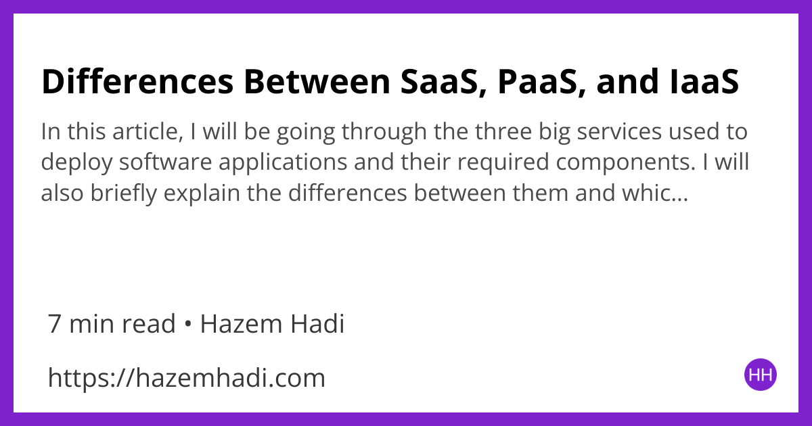

# OG Image Generator CLI Tool

## Description

Create an OG image for an article on your website with this CLI tool.

**Note: The code is pretty messy and needs to be refactored.**

## Pre-requisites

- Go 1.18
- Background Image - 1200 X 630 pixels
- Icon Image - 48 X 48 pixels

## Usage

Make sure that you have the **Background Image** (file named background.png) and **Icon Image** (file names icon.png) in the same directory as the executable.

Run the following command:

```bash
go run . --title="<TITLE HERE>" --description="<DESCRIPTION HERE>" --minutes=7 --author="<AUTHOR NAME HERE>" --website="<WEBSITE URL HERE>"
```

Or you can build the executable and run it:

```bash
go build .
./og-generator --title="<TITLE HERE>" --description="<DESCRIPTION HERE>" --minutes=7 --author="<AUTHOR NAME HERE>" --website="<WEBSITE URL HERE>"
```

## Example

Run

```bash
./og-generator --title="Differences Between SaaS, PaaS, and IaaS" --description="In this article, I will be going through the three big services used to deploy software applications and their required components. I will also briefly explain the differences between them and which method you should use to deploy your own software application." --minutes=7 --author="Hazem Hadi" --website="https://hazemhadi.com"
```

Output:



## Credits

Heavily relies on the below referenced article:
https://pace.dev/blog/2020/03/02/dynamically-generate-social-images-in-golang-by-mat-ryer.html